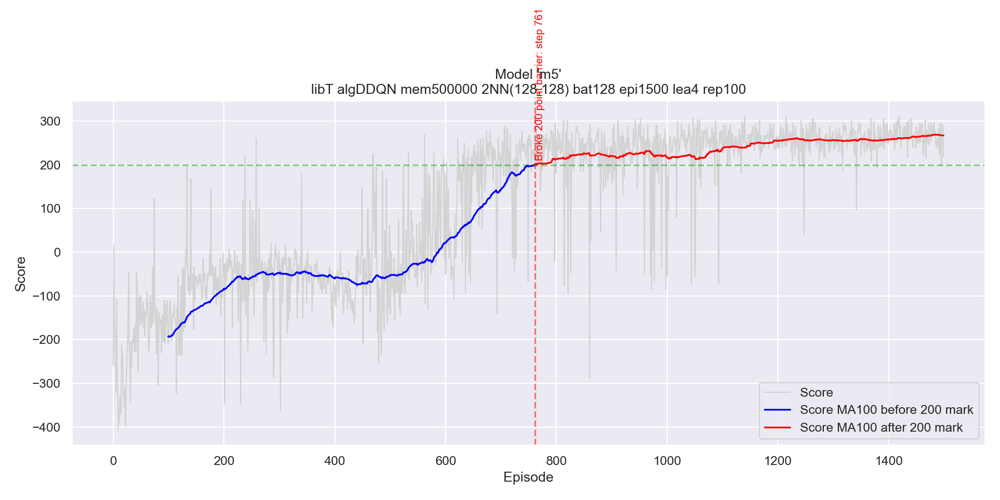
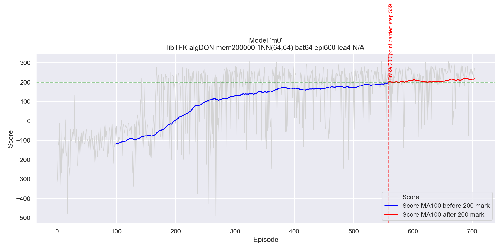

# 🚀 Lunar Lander — Solved with (D)DQN

<p align="center">
  
  
  
  
  
</p>

<p align="center">
  <b>Trained Agent Landing</b> &nbsp;&nbsp;&nbsp;&nbsp;&nbsp;&nbsp;&nbsp; <b>Untrained Agent Landing</b>
</p>

<p align="center">
  <video src="https://github.com/Groot-PAS/lunar-lander-ddqn/raw/main/video/agentm5.mp4" width="45%" controls></video>
  &nbsp;&nbsp;
  <video src="https://github.com/Groot-PAS/lunar-lander-ddqn/raw/main/video/agentuntrained.mp4" width="45%" controls></video>
</p>

---

## 📋 Table of Contents

- [Problem Definition](#-problem-definition)
- [Background & Theory](#-background--theory)
- [Method](#-method)
- [Architecture](#-architecture)
- [Results](#-results)
- [Project Structure](#-project-structure)
- [Getting Started](#-getting-started)
- [Training & Usage](#-training--usage)
- [Implementation Notes](#-implementation-notes)
- [References](#-references)

---

## 🌕 Problem Definition

The **Lunar Lander** environment ([Gymnasium](https://gymnasium.farama.org/environments/box2d/lunar_lander/)) simulates landing a small spacecraft on the moon surface. The goal is to navigate the lander between two flags at coordinates `(0, 0)` without crashing.

### State Space (8-dimensional)

| Index | Description |
|-------|-------------|
| 0, 1 | x, y coordinates of the lander |
| 2, 3 | Linear velocities in x, y |
| 4 | Lander angle |
| 5 | Angular velocity |
| 6, 7 | Boolean — whether each leg is in contact with the ground |

### Action Space (Discrete, 4 actions)

| Action | Description |
|--------|-------------|
| `0` | Do nothing |
| `1` | Fire left orientation engine |
| `2` | Fire main engine |
| `3` | Fire right orientation engine |

### Reward Structure

- ✅ **+100** for landing safely
- ❌ **−100** for crashing
- 📍 Increases/decreases based on proximity to landing pad
- 🐢 Increases/decreases based on lower/higher speed
- 📐 Decreases when the lander is tilted
- 🦵 **+10** per leg in contact with the ground
- 🔥 **−0.03** per frame a side engine fires
- 🔥 **−0.3** per frame the main engine fires

> An episode is considered **solved** when it achieves a score ≥ 200 points (averaged over 100 consecutive episodes).

---

## 📚 Background & Theory

The Lunar Lander features a large, continuous state space — making tabular Q-learning infeasible. The solution leverages **Deep Q-Networks (DQN)**, which use a neural network as a function approximator for the Q-value instead of a lookup table.

### Why not simpler methods?
- **Dynamic Programming** — requires perfect environment knowledge (not available here)
- **Monte Carlo** — requires complete episodes; slow convergence and high memory usage
- **Tabular Q-learning** — infeasible for continuous state spaces

### DQN vs DDQN

Standard **DQN** uses a single neural network for both action selection and target Q-value estimation. This introduces a **maximisation bias** — the agent overestimates Q-values because the same network selects and evaluates actions simultaneously.

**Double DQN (DDQN)** solves this by using two networks:
- **Online network** — selects the best action
- **Target network** — evaluates that action's Q-value

The target network is periodically synced with the online network (every N steps), keeping target values more stationary and improving training stability.

---

## 🧠 Method

Both DQN and DDQN were implemented and compared. The core components are:

### Experience Replay Buffer
A fixed-size memory buffer stores past `(state, action, reward, next_state, done)` transitions. At each training step, a random mini-batch is sampled, breaking temporal correlations and stabilising learning.

### Training Loop (per episode step)
1. Agent observes the current state
2. Chooses an action via **ε-greedy policy** (explore vs exploit)
3. Executes the action, receives reward & next state
4. Stores the transition in the replay buffer
5. Every 4 steps, samples a mini-batch and trains the online network
6. Every N steps, copies online network weights to target network
7. Decays ε over time (reduces exploration as agent improves)

### Key Hyperparameters (Best Model — m5)

| Parameter | Value |
|-----------|-------|
| Algorithm | DDQN |
| ML Library | PyTorch |
| Memory Size | 500,000 transitions |
| Neural Network | 2 hidden layers × 128 neurons |
| Batch Size | 128 |
| Episodes | 1,500 |
| Learn every N steps | 4 |
| Target network sync | Every 100 steps |
| Learning Rate | 0.001 |
| Discount (γ) | 0.99 |
| Epsilon decay | 0.996 |
| Epsilon min | 0.01 |

---

## 🏗️ Architecture

```
Input (8)
   │
   ▼
┌─────────────┐
│  Linear(128) │  ← fc1
│    ReLU      │
└─────────────┘
   │
   ▼
┌─────────────┐
│  Linear(128) │  ← fc2
│    ReLU      │
└─────────────┘
   │
   ▼
┌─────────────┐
│  Linear(4)  │  ← Output (Q-value per action)
└─────────────┘
```

Both the **online** and **target** networks share this architecture. The target network's weights are periodically copied from the online network.

---

## 📊 Results

### Best Model (DDQN — m5)

The best performing model was a **DDQN with PyTorch**, using two hidden layers of 128 neurons. It broke the 200-point barrier at **episode 761** and continued improving, reaching an average score of ~270 by episode 1500.



### Baseline Model (DQN — m0)

The baseline **DQN with TensorFlow/Keras** (64×64 network) broke the 200-point barrier at **episode 559** and stabilised around 220 thereafter.



### Key Findings

- **Network width** has a significant impact — 128+ neurons per layer converge faster and achieve higher scores
- **DDQN** showed more stable and consistent post-convergence performance compared to DQN
- **PyTorch** was significantly faster and more memory-efficient than TensorFlow/Keras for this workload (see [Implementation Notes](#-implementation-notes))

---

## 📁 Project Structure

```
lunar-lander-ddqn/
├── ddqn_torch.py            # PyTorch DDQN implementation (recommended)
├── ddqn_tfkeras.py          # TensorFlow/Keras DQN & DDQN implementation
├── run.py                   # Training & watching a trained agent
├── plot_training.py         # Plot training curves from saved stats
├── lunarlander-torch.ipynb  # PyTorch training notebook
├── lunarlander-tfkeras.ipynb# TensorFlow/Keras training notebook
├── visual_comparison.ipynb  # Side-by-side model comparison
├── ddqn_torch_model.h5      # Pretrained online network weights (PyTorch)
├── ddqn_torch_model_h5.target # Pretrained target network weights
├── training_plot_m0.png     # Training curve — DQN baseline
├── training_plot_m5.png     # Training curve — best DDQN model
├── stats/                   # JSON score/epsilon histories per model
├── docs/                    # Report figures and LaTeX source
├── video/                   # Recorded agent episodes
└── requirements.txt         # Python dependencies
```

---

## 🚀 Getting Started

### Prerequisites

- Python 3.8+
- pip

### Installation

```bash
# Clone the repository
git clone https://github.com/YOUR_USERNAME/lunar-lander-ddqn.git
cd lunar-lander-ddqn

# Install dependencies
pip install -r requirements.txt
```

**`requirements.txt`**
```
gymnasium
gymnasium[box2d]
numpy
torch
tensorflow
keras
moviepy
dill
```

> **Note for macOS (Apple Silicon):** The TensorFlow/Keras implementation does not work on M1/M2 Macs due to compatibility issues with Gymnasium's Box2D environment. Use the PyTorch implementation instead.

---

## 🎮 Training & Usage

### Watch the Pretrained Agent

```bash
python run.py --watch
```

This loads `ddqn_torch_model.h5` and renders 3 episodes in a window.

### Train from Scratch (Quick Demo — 20 episodes)

```bash
python run.py
```

### Full Training Run

```bash
python run.py --episodes 1500
```

### Resume Training from Saved Model

```bash
python run.py --episodes 1500 --load
```

### Plot Training Curves

Requires `stats/` directory with score histories:

```bash
python plot_training.py              # First available model
python plot_training.py --model m5   # Specific model key
```

### Custom Usage in Python

```python
from ddqn_torch import DoubleQAgent
import gymnasium as gym

env = gym.make("LunarLander-v3")
agent = DoubleQAgent(gamma=0.99, epsilon=1.0, lr=0.001,
                     mem_size=200000, batch_size=128)

# Load pretrained weights
agent.load_saved_model("ddqn_torch_model.h5")

# Watch it run
state, _ = env.reset()
terminated = truncated = False
while not (terminated or truncated):
    action = agent.choose_action(state)
    state, reward, terminated, truncated, _ = env.step(action)
```

---

## 🔧 Implementation Notes

### Why Two Implementations?

The project was initially developed using **TensorFlow/Keras**. However, this caused significant issues:

- Memory leaked progressively with each training episode on the development machine
- Training had to be split across 10+ separate sessions over two days, each ending in out-of-memory crashes
- The agent's model weights and replay buffer were checkpointed to disk between sessions

After switching to **PyTorch**, training speed improved approximately **100×** with no memory issues. All models beyond the baseline (m0) were trained using PyTorch. Both implementations are included for reference.

### Implementation Differences

| Feature | TensorFlow/Keras (`ddqn_tfkeras.py`) | PyTorch (`ddqn_torch.py`) |
|--------|--------------------------------------|--------------------------|
| Network | `Sequential` with `Dense` layers | `nn.Module` with `nn.Linear` |
| Optimizer | `Adam` via Keras | `optim.Adam` |
| Memory buffer | Returns numpy arrays | Returns PyTorch tensors (CUDA-ready) |
| GPU support | Via TF config | Automatic via `torch.device` |
| Model saving | `model.save()` + pickle | `state_dict()` |

---

## 📖 References

- Mnih, V. et al. (2015). *Human-level control through deep reinforcement learning*. Nature, 518, 529–533.
- Van Hasselt, H., Guez, A., & Silver, D. (2016). *Deep Reinforcement Learning with Double Q-learning*. AAAI.
- Sutton, R.S. & Barto, A.G. (2018). *Reinforcement Learning: An Introduction*. MIT Press.
- [Gymnasium LunarLander-v3 Documentation](https://gymnasium.farama.org/environments/box2d/lunar_lander/)

---

<p align="center">
  Made with ❤️ and a lot of crashed landers
</p>
